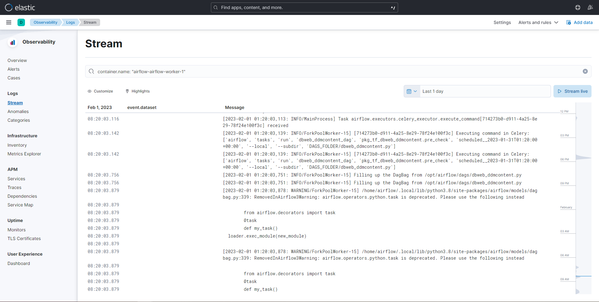

### Airflow

1. How to deploy
    
    1.1. Fill credentials in field `x-airflow-common:` from file `airflow-docker-compose.yaml`

    ```yaml
        DBT_TRINO_USER: xxx
        DBT_TRINO_PASSWORD: xxx
        DBT_ORACLE_USER: xxx
        DBT_ORACLE_PASSWORD: xxx
        DBT_ORACLE_WZ_USER: xxx
        DBT_ORACLE_WZ_PASSWORD: xxx
    ```
    1.2. Deploy using `docker compose`
    ```bash
    cd airflow
    docker compose -f airflow-docker-compose.yaml up -d
    ```

2. Add environment variable for Bash operators

    Please add to `x-airflow-common:` same as credentials-to-fill variables in 1.1 then restart docker compose.

### ELK

1. How to deploy
    ```bash
    docker compose -f elk/docker-compose.yml -f elk/extensions/filebeat/filebeat-compose.yml up -d 
    ```

    Then you can access Kibana at `http://your-server-ip:5601` with username `elastic` and password `changeme`.

2. How to search logs in Kibana:
    - Navigate to `Observability` -> `Logs` -> `Stream`, then use the search bar to start searching. 
    

3. Configure `filebeat` to transfer logs to `elasticsearch`
    - Open file `elk/extensions/filebeat/config/filebeat.yml`
    - Replace the line `hosts: ['http://elasticsearch:9200']` with your `elasticsearch` server, for example: `http://10.0.4.124:9200`.

### Trino

1. How to deploy
    ```bash
    cd trino
    docker compose -f trino-docker-compose.yaml up -d 
    ```

2. Add new connection
    - Navigate to folder `etc/catalog` and add a new file `x.properties`. The `x` here will be displayed on DBeaver when you connect to Trino.
    - To write file `x.properties`, please refer to this document https://trino.io/docs/current/connector.html.
    - Restart docker container `trino` to load your new configuration

3. Add new users to Trino:
    
    We currently employ password file authentication. Please add a new user to Trino based on this documentation: https://trino.io/docs/current/security/password-file.html#creating-a-password-file

### git-sync

1. How to deploy

    1.1. Fill credentials in `git-sync-docker-compose.yaml`:
    ```yaml  
    GIT_SYNC_USERNAME: xxx
    GIT_SYNC_PASSWORD_FILE: "/run/secrets/bitbucket_password"
    ```

    1.2. Deploy using `docker compose`
    ```bash
    cd git-sync
    docker compose -f git-sync-docker-compose.yaml up -d
    ```

2. How to add a new sync:

    Create a new `git-sync-2` service from `git-sync` in the docker compose yaml file, then edit it based on your preferences.
